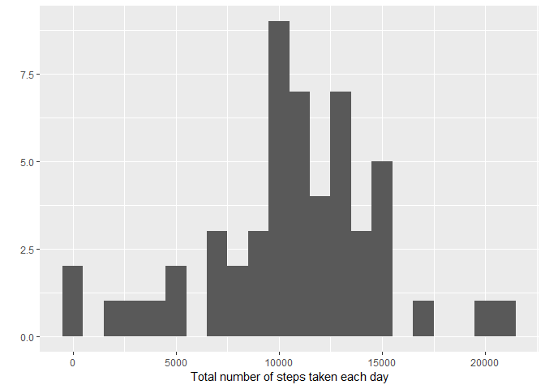
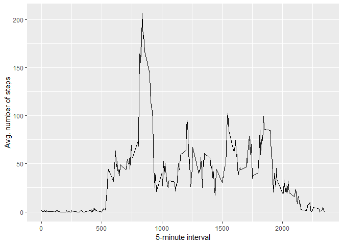
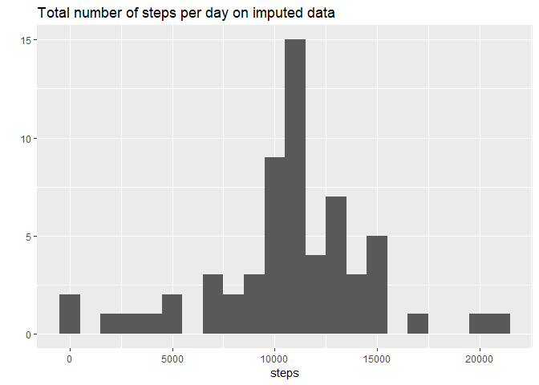
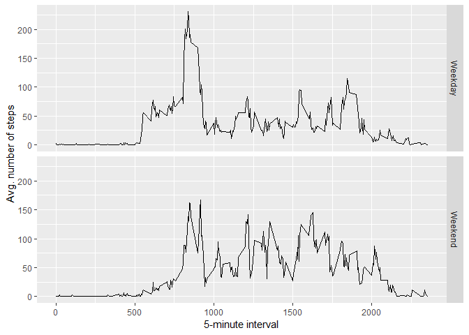

## Loading and preprocessing the data


```r
library(dplyr)
```

```
## 
## Attaching package: 'dplyr'
```

```
## The following objects are masked from 'package:stats':
## 
##     filter, lag
```

```
## The following objects are masked from 'package:base':
## 
##     intersect, setdiff, setequal, union
```

```r
library(ggplot2)
```

### 1. Loading and unzipping the file from the URL


```r
temp <- tempfile()
download.file("https://d396qusza40orc.cloudfront.net/repdata%2Fdata%2Factivity.zip", temp)
activity <- read.csv(unz(temp,"activity.csv"))
rm(temp)
```

### 2. Pre-processing the data


```r
activity = activity %>%
  mutate(fixed_date = as.Date(date))
```


## What is mean total number of steps taken per day?

### 1. Summing the steps per day


```r
steps_per_day <- activity %>%
  filter(!is.na(steps)) %>%
  group_by(fixed_date) %>%
  summarise(steps = sum(steps))
```

### 2. Histogram of the summed steps per day


```r
qplot(steps, data = steps_per_day, geom = "histogram", xlab = "Total number of steps taken each day", binwidth = 1000)
```

<!-- -->

### 3. Reporting the mean and median of the total number of steps taken per day


```r
steps_per_day_mean <- mean(steps_per_day$steps)
steps_per_day_median <- median(steps_per_day$steps)
```

* The mean is: 

```r
steps_per_day_mean
```

```
## [1] 10766.19
```

* The median is: 

```r
steps_per_day_median
```

```
## [1] 10765
```


## What is the average daily activity pattern?

### 1. Average number of steps averaged accross all days grouped by the 5-minute interval


```r
avg_steps_interval <- activity %>%
  filter(!is.na(steps)) %>%
  group_by(interval) %>%
  summarise(steps = mean(steps))
```

### 2. Time series plot


```r
ggplot(avg_steps_interval, aes(x=interval, y=steps)) +
  geom_line()+
  xlab("5-minute interval") +
  ylab("Avg. number of steps")
```

<!-- -->

### 3. Which 5-minute interval, on average across all the days in the dataset, contains the maximum number of steps?


```r
max_avg_steps_interval <- avg_steps_interval[which.max(avg_steps_interval$steps),'interval']
max_avg_steps_steps <- round(avg_steps_interval[which.max(avg_steps_interval$steps),'steps'])
```

* The interval that contains the maximum number of steps on average accross all days is: 835 with 206 steps.


## Imputing missing values

### 1. Reporting the missing values in the data set


```r
missing_values <- length(which(is.na(activity$steps)))
```

There are 2304 missing values in the dataset.

### 2. Creating  a duplicate data set where we will impute the NAs


```r
activity_imp = activity
```

### 3. Devising a strategy for the imputing


```r
for(i in 1:nrow(activity_imp)) {
  if(is.na(activity_imp$steps[i])) {
    impute_value = avg_steps_interval$steps[avg_steps_interval$interval == activity_imp$interval[i]]
      activity_imp$steps[i] = impute_value
  }
}
```

### 4. Summing up the steps per day


```r
steps_per_day_imp <- activity_imp %>%
  group_by(fixed_date) %>%
  summarise(steps=sum(steps))
```

### 5. Histogram of the total number of steps per day


```r
qplot(steps, data = steps_per_day_imp, geom = "histogram", main="Total number of steps per day on imputed data", binwidth = 1000)
```

<!-- -->

### 6. Reporting the mean and the median


```r
steps_per_day_imp_mean <- mean(steps_per_day_imp$steps)
steps_per_day_imp_median <- median(steps_per_day_imp$steps)
```

* The mean on the imputed data is:

```r
steps_per_day_imp_mean
```

```
## [1] 10766.19
```

* The median on the imputed data is: 

```r
steps_per_day_imp_median
```

```
## [1] 10766.19
```


## Are there differences in activity patterns between weekdays and weekends?

### 1. Creating a factor variable for "Weekday" and "Weekend"


```r
activity_imp_days = activity_imp %>%
  mutate(day_type = as.factor(ifelse(weekdays(fixed_date) %in% c('Saturday', 'Sunday'), 'Weekend', 'Weekday')))
```

### 2. Average number of steps averaged accross all days grouped by the 5-minute interval


```r
avg_steps_interval_imp <- activity_imp_days %>%
  group_by(interval, day_type) %>%
  summarise(steps=mean(steps))
```

### 3. Time series plot


```r
ggplot(avg_steps_interval_imp, aes(x=interval, y=steps)) +
  geom_line()+
  facet_grid(day_type~.)+
  xlab("5-minute interval") +
  ylab("Avg. number of steps")
```

<!-- -->
